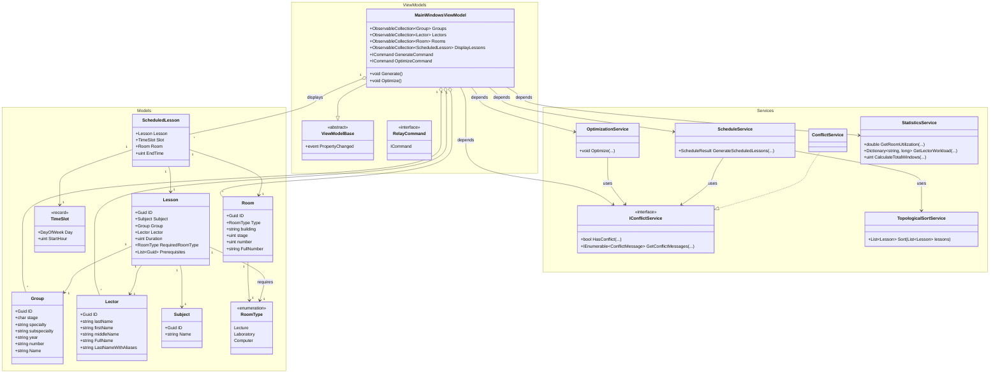

<div align="center">

# Планировщик университетского расписание


В условиях современного высшего образования эффективное управление ограниченными ресурсами — аудиторным фондом, временем преподавательского состава и учебной нагрузкой студентов — становится сложной логистической задачей. Традиционные методы ручного составления расписания для десятков учебных групп и сотен академических часов сопряжены с высоким риском возникновения конфликтов и нерациональным использованием пространства. Автоматизация этого процесса позволяет не только исключить пересечения занятий, но и значительно повысить эргономичность образовательной среды за счёт минимизации временных разрывов («окон»).

</div>

### Технологический стек

| Инструмент      | Версия | Для чего?                                                |
|:----------------|:------:|:---------------------------------------------------------|
| C#              |   14   | Язык программирования                                    |
| .NET            |   10   | Платформа и среда исполнения                             |
| WPF             |   -    | Фреймворк для графического пользовательского интерфейса  |
| xUnit           | 3.2.2  | Фреймворк для модульного тестирования                    |
| coverlet        | 6.0.4  | Сборщик отчёта по покрытию тестами                       |
| ReportGenerator | 5.4.1  | Конвертация отчёта по покрытию в человекочитаемый формат |

## Архитектура проекта

- `Models` - уровень домена, здесь содержатся все типы сущностей
  - `Group` - студенческая группа
  - `Lector` - преподаватель
  - `Lesson` и `ScheduledLesson` - занятие и спланированное занятие
  - `Room` и `RoomType` - аудитория и её тип
  - `Subject` - предмет
  - `TimeSlot` - Временной слот
- `Services` - уровень логики, здесь происходит всё взаимодействие с доменами
  - `ConflictService` - служба, ответственная за поиск конфликтов
  - `OptimizationService` - служба, ответственная за оптимизацию расписания, то есть за избавление от "окон" в расписании,
  - `StatisticsService` - статистика по "окнам", загруженности и т.д.
  - `TopologicalSortService` - топологическая сортировка (DAG).
  - `ScheduleService` - сервис, ответственный за составление расписания.
- `UI` - представление, он же графический интерфейс.


### UML блок-схема
Для большей наглядности, ниже представлена UML диаграма самого проекта.



## Развёртка

### Скачать уже собранный проект
Отчёт по покрытию, сам отчёт по курсовому проекту и программа лежат во вкладке [Releases](https://github.com/tstu-artemos-projects/BaseOfProgLabs/releases)
(автоматически  собирается и тестируется)

### Сборка из исходного кода

1. Установите [.NET отсюда](https://dotnet.microsoft.com/en-us/download), а также [Git отсюда](https://git-scm.com/install).
2. Склонируйте репозиторий
  ```shell
    git clone https://github.com/Urtyom-Alyanov/UniversityScheduler.git
  ```
3. В директории проекта соберите и запустите его
    ```shell
      dotnet run
    ```
